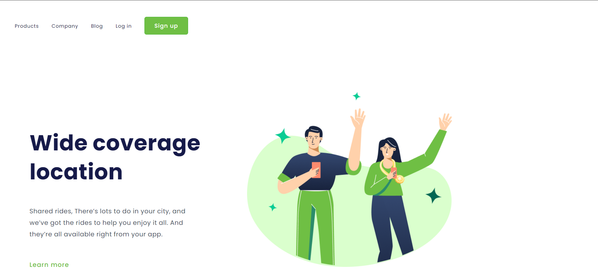

<h1>
Wide Coverage Location
</h1>

<h2>
📕 Sobre o projeto 
</h2>

Esse projeto foi desenvolvido durante as aulas do DevClub, no qual colocamos em prática o conhecimento adquirido nas aulas dos primeiros módulos de HTML e CSS.

<h2>
🔨 Ferramentas
</h2> 

<ul>
<li>HTML</li>
<li>CSS</li>
</ul>

